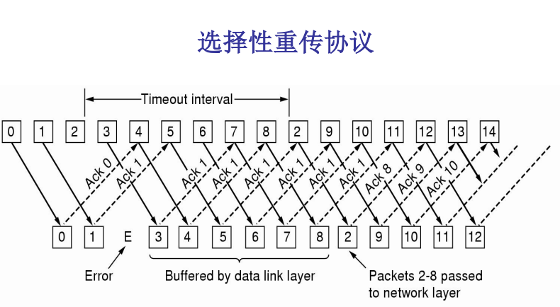

# 实验三 RDT通信程序设计

[TOC]

在上一次实验中, 我们学习了socket的使用并且编写了TCP/UDP通信程序. 为了加深对可靠数据重传中校验和, 序列号, 确认机制, 超时重传及滑动窗口的理解, 本次实验要求在UDP的基础上实现简化版的可靠数据传输协议 ( Reliable data transfer protocols, RDT ) , 并利用RDT传输一份文件

## 1 实验原理

### 1.1 可靠通信

-   在实际应用的过程中, 我们可以用很多种方法来实现可靠的通信. 此处仅对本次实验所需的方式作简要介绍, 更多具体内容请参考理论课上老师提供的PPT与教材

    -   停等协议

        -   发送端
            -   每次发送一个包, 然后阻塞等待, 直到收到接收端回送的<kbd>ACK</kbd>, <kbd>NACK</kbd>或超时
            -   如果收到对该包的<kbd>ACK</kbd>, 则发送下一个包; 如果收到对某包的<kbd>NACK</kbd>, 则发送序号直接移动到这个包; 如果超时则重新发送该包
        -   接收端
            -   需要记住当前预期的数据包的序列号<kbd>expectedseqnum</kbd>
            -   每接收一个包便回复该包的<kbd>ACK</kbd>进行确认
            -   接收到序号不一致的包则回复对期望数据包的<kbd>NACK</kbd>
        -   最简单的办法但效率太低

    -   滑动窗口协议

        -   发送端每次可以发送很多个包, 然后等待接收端回送<kbd>ACK</kbd>或超时

        -   接收端不一定会按照顺序收到每一个包, 也会根据不同协议决定是否给每一个包都返回<kbd>ACK</kbd>

        -   回退N协议

            -   原理图如图所示

                

            -   发送端
    
                -   一次性发送<kbd>[base, base+N-1]</kbd>的滑动窗口, 为每个正在发送的数据包设置一个定时器
            
                -   如果数据包<kbd>k</kbd>出现超时, 那么发送端必须重传第<kbd>k</kbd>个包以及其后的所有的包
            
            -   接收端
            
                -   需要记住当前预期的数据包的序列号<kbd>expectedseqnum</kbd>
            
                -   如果收到完整的数据包, 并且包序号等于期望序号<kbd>expectedseqnum</kbd>, 则发送期望序号包的<kbd>ACK</kbd>消息; 否则将数据包丢弃, 发送期望序号包的<kbd>NACK</kbd>
            
                -   由于接收端进行累计确认, 发送端无法获知这之后的包是否正确收到了, 因此这种方法效率较低. 如果丢失了中间一个包而后续所有包都正确到达了, 那么发送端将浪费大量资源进行重传
        
        -   选择重传协议
    
            -   原理图如图所示
        
                
        
            -   发送端
                -   一次性发送<kbd>[base, base+N-1]</kbd>的滑动窗口, 为每个正在发送的数据包设置一个定时器
                -   如果数据包<kbd>k</kbd>出现超时或收到了<kbd>NACK</kbd>, 那么发送端重传该包
                
            -   接收端
                
                -   需要记住当前预期的数据包的序列号<kbd>expectedseqnum</kbd>
                -   如果收到完整的数据包, 并且包序号在滑动窗口内, 则发送该包的<kbd>ACK</kbd>消息; 否则发送期望序号包的<kbd>NACK</kbd>
                
            -    由于发送端只重新发送超时的包或者收到NACK的包, 因此大大降低了重传的开销
    
-    停等协议相当于发送接收窗口均为1; 回退N协议相当于发送窗口不为1但接收窗口为1; 选择重传协议相当于发送接收窗口均不为1

### 1.2 RDT数据包

-   我们所定义的基于UDP的可靠RDT协议的字段组成方式如下

    | 字段名称 | UDP_Header        | RDT_State                 | RDT_Sequence                | Data                       |
    | -------- | ----------------- | ------------------------- | --------------------------- | -------------------------- |
    | 相关信息 | UDP头标, 自动生成 | RDT状态域, 4B, 标识包类型 | RDT序号域, 4B, 标识包的序号 | 数据段, 被传输的应用层数据 |

- 状态域可能的值如下

  ```c
  // RDT包状态域类型枚举
  enum Enum_RDT_State
  {
      // 初始包
      RDT_State_BEGIN = 0,
      // 数据包
      RDT_State_DATA,
      // ACK包
      RDT_State_ACK,
      // NACK包
      RDT_State_NACK,
      // 结束包
      RDT_State_END,
  };
  ```

- 序列号域用来标识此RDT包的序列号, 在实验中从1开始并且永不循环

  ```c
  // RDT数据包初始序列号, 假设数据包序列号不循环
  #define RDT_BEGIN_SEQUENCE 1
  ```

-   实际使用中, <kbd>RDT_Packet_Type</kbd>和<kbd>RDT_Seq_Num</kbd>都是整型变量. 因此一个RDT数据包的头部字段长度为$4 + 4 = 8$

### 1.3 多线程编程介绍

-   多线程, 指的是同时或近乎同时执行多个任务的一种技术, 常见的实现方式有硬件与软件两种. 硬件多线程, 可通过多个处理器芯片协同工作等方式实现; 而软件多线程则可以通过极短时间内快速切换多个任务执行等方式实现. 通过多线程编程, 可以解决很多单线程较难实现的工作, 比如同时执行多任务, 快速高效处理突发事件等. 由于本实验在Linux系统下进行, 现如今大多数计算机均有多核处理器, 因此多线程编程在硬件支持上是足够的. 本次实验将引入多线程编程, 可以实现滑动窗口协议中发送与接收两个主要任务的并发运行

-   常见的多线程创建函数有<kbd>fork()</kbd>, <kbd>pthread_create()</kbd>等, 其相关的库函数unistd.h与pthread.h已在net.h中包含. 下面以pthread.h为例进行相关函数的介绍. 本实验编译可通过makefile正常编译, 如需在vscode中编译可能会遇到pthread报错情况, 请参考链接: https://www.cnblogs.com/wenwenaolin/p/16373701.html解决问题

-   pthread线程的创建与销毁. 创建的线程将以对声明的函数调用的方式实现. 如果函数返回, 则线程自动销毁. 因此如有必要可将线程内置while(1)死循环. 此处可以类比计算机原理与嵌入式系统课程实验中的前台程序. 线程也可通过父线程调用函数方式被动销毁

    -   本实验相关库pthread.h已在net.h中包含

    -   pthread_create

        ```C
        int pthread_create(pthread_t *thread, const pthread_attr_t *attr, void *(*start_routine)(void *), void *arg);
        ```

        -   函数<kbd>pthread_create()</kbd>将创建一个线程
        -   <kbd>pthread_create()</kbd>需要四个参数
            -   <kbd>thread</kbd>: 线程变量指针, 一般需要自行声明或定义该变量
            -   <kbd>attr</kbd>: 线程配置选项参数, 本实验直接配置<kbd>NULL</kbd>代表默认配置即可
            -   <kbd>start_routine</kbd>: 线程绑定的函数, 即该线程将执行该函数. 该函数必须为<kbd>void * function(void *)</kbd>格式, 否则编译会报错
            -   <kbd>arg</kbd>: <kbd>start_routine</kbd>函数的参数表指针, 用于指示传参内容所在地址
        -   <kbd>pthread_create()</kbd>成功时返回0, 如果发生错误则返回非0

    -   pthread_cancel

        ```C
        int pthread_cancel(pthread_t thread);
        ```

        -   函数<kbd>pthread_cancel()</kbd>将销毁一个线程
        -   <kbd>pthread_cancel()</kbd>需要一个参数
            -   <kbd>thread</kbd>: 被销毁的线程变量
        -   <kbd>pthread_cancel()</kbd>成功时返回0, 如果发生错误则返回非0

-   pthread线程的互斥锁 ( 互斥量 ) . 互斥锁可以保证只有一个线程对被保护内容的访问. 其工作方式为: 父线程调用初始化互斥锁函数<kbd>pthread_mutex_init()</kbd>后调用<kbd>pthread_create()</kbd>创建一系列线程. 某线程A调用上锁函数<kbd>pthread_mutex_lock()</kbd>对互斥锁锁定, 而后该线程正常运行. 线程A对被保护内容访问结束后调用解锁函数<kbd>pthread_mutex_unlock()</kbd>解除锁定. 而其余线程将在它们线程中各自调用互斥锁的上锁函数<kbd>pthread_mutex_lock()</kbd>, 使各线程分别阻塞在上锁函数处直至线程A调用解锁函数<kbd>pthread_mutex_unlock()</kbd>对该互斥锁解除锁定. 关于互斥锁更多内容可参考链接: https://blog.csdn.net/u011774517/article/details/108829013

    -   本实验相关库pthread.h已在net.h中包含

    -   pthread_mutex_init

        ```C
        int pthread_mutex_init(pthread_mutex_t *mutex, const pthread_mutexattr_t *mutexattr);
        ```

        -   函数<kbd>pthread_mutex_init()</kbd>会初始化一个互斥量
        -   <kbd>pthread_mutex_init()</kbd>需要两个参数
            -   <kbd>mutex</kbd>: 互斥量指针, 一般要自行声明或定义该变量, 而且一般是全局变量
            -   <kbd>mutexattr</kbd>: 互斥量参数配置, 本实验直接配置<kbd>NULL</kbd>代表默认配置即可
        -   <kbd>pthread_mutex_init()</kbd>成功时返回0, 如果发生错误则返回非0

    -   pthread_mutex_destroy

        ```C
        int pthread_mutex_destroy(pthread_mutex_t *mutex);
        ```

        -   函数<kbd>pthread_mutex_destroy()</kbd>将销毁一个互斥量
        -   <kbd>pthread_mutex_destroy()</kbd>需要一个参数
            -   <kbd>mutex</kbd>: 被销毁的互斥量指针
        -   <kbd>pthread_mutex_destroy()</kbd>成功时返回0, 如果发生错误则返回非0

    -   pthread_mutex_trylock

        ```C
        int pthread_mutex_trylock(pthread_mutex_t *mutex);
        ```

        -   函数<kbd>pthread_mutex_trylock()</kbd>将对一个没上锁的互斥量上锁, 或对一个上锁的互斥量报错
        -   <kbd>pthread_mutex_trylock()</kbd>需要一个参数
            -   <kbd>mutex</kbd>: 被上锁的互斥量指针
        -   <kbd>pthread_mutex_trylock()</kbd>成功上锁时返回0, 如果已被上锁则返回非0

    -   pthread_mutex_unlock

        ```C
        int pthread_mutex_unlock(pthread_mutex_t *mutex);
        ```

        -   函数<kbd>pthread_mutex_unlock()</kbd>将对一个互斥量解锁
        -   <kbd>pthread_mutex_unlock()</kbd>需要一个参数
            -   <kbd>mutex</kbd>: 被解锁的互斥量指针
        -   <kbd>pthread_mutex_unlock()</kbd>成功时返回0, 如果发生错误则返回非0

## 2 实验内容

1.  实验要求

    -   本实验在Linux环境下进行, Windows环境亦可但需要使用不同的头文件包含以及额外的配置操作
    -   本实验传输的文件路径与名称以命令行参数 ( 通俗来讲main函数传参 ) 形式获取, main函数也有一版便于直接调用vscode调试使用的固定文件路径字符串的版本, 修改注释位置即可直接使用
    -   阅读并理解[实验参考代码](code), 注意本次实验的net.h文件与上次实验的net.h文件内容不同, 请同学们仔细阅读
        -   对比代码可以使用vscode自带的对比功能
        -   本实验中, 滑动窗口数据结构通过队列实现, 实验给出的代码框架采用了链表队列形式, 同学们可通过参考代码中队列测试代码了解其使用方式. 另外, C++中有更简便的STL库, 内含各种数据结构, 考虑到同学们的C++基础以及课程新知识含量, 本实验仅做介绍, 不对C++作额外要求. 当然同学们也可通过C++的方式实现滑动窗口的数据结构
    -   本次实验为完形填空形式, 需要同学将文件尾部选项的代码片段粘贴到对应的TODO注释标记的部分
    -   根据实验参考代码完成下面的实验
    
2.  完成停等协议的RDT发送端程序
    -   涉及的文件有[net.h](code/net.h), [queue.h](code/queue.h), [rdt_stopwait_sender.cpp](code/rdt_stopwait_sender.cpp)
    -   需要修改的文件有[rdt_stopwait_sender.cpp](code/rdt_stopwait_sender.cpp)
    
    -   实验参考代码中, 停等协议接收端代码已完成, 可用来帮助调试
    -   本实验无需改动接收端程序, 且此实验可以被认为是发送窗口和接收窗口长度均为1的滑动窗口
    
3.  完成回退N协议的RDT发送端程序

    -   涉及的文件有[net.h](code/net.h), [queue.h](code/queue.h), [rdt_gobackn_sender.cpp](code/rdt_gobackn_sender.cpp)
    -   需要修改的文件有[rdt_gobackn_sender.cpp](code/rdt_gobackn_sender.cpp)
-   可以用上一步编写的接收端程序调试, 因为回退N的接收端可以被认为是窗口长度为1的滑动窗口
    -   文件夹下的[rdt_stopwait_receiver.cpp](code/rdt_stopwait_receiver.cpp)与[rdt_gobackn_receiver.cpp](code/rdt_gobackn_receiver.cpp)文件内容完全相同

4.  选做题, 实现选择重传协议

## 实验报告

1.  实验报告要求完成以下思考题
    -   RDT底层是UDP, 为什么程序中可以用<kbd>recv/send</kbd>而不是<kbd>recvfrom/sendto</kbd>收发数据
    -   停等发送端程序中是如何实现超时重传的
    -   参考两军对垒问题, 在有发送和接收失败的情况下, 怎么保证双方正确地结束通信
    -   在选择重传协议中, 为何窗口大小必须小于或等于序列号空间大小的一半

## 附录1 实验指导视频

-   本次实验指导视频链接
    -   https://www.bilibili.com/video/BV1sM4y1P76z

## 附录2 辅助函数介绍

-   poll

    ```C
    int poll(struct pollfd *fds, nfds_t nfds, int timeout);
    ```

    -   这一次实验我们会用到更高级的socket函数<kbd>poll()</kbd>. 在 Linux, 它已被<kbd>ppoll()</kbd>和<kbd>epoll()</kbd>取代. 为了简单起见, 我们这里仍然使用<kbd>poll()</kbd>完成实验. poll这个单词的意思是轮询, 函数<kbd>poll()</kbd>可以用来等到一组文件描述符中的一个准备好执行I/O操作. 本次实验, 我们可以在停等协议的发送端使用<kbd>poll()</kbd>来检查套接字是否有可读的<kbd>ACK</kbd>数据

    -   <kbd>poll()</kbd>需要三个参数

        -   <kbd>fds</kbd>:  要监视的文件描述符集, 结构如下

            ```C
            struct pollfd
            {
              // 文件描述符
              int   fd;
              // 关注的事件, 该描述符是可读可写或异常
              short events;
              // 返回的事件, 真正发生了什么
              short revents;
            };
            ```

            其中, <kbd>events</kbd>的值需要自己设置, 定义的是我们所关注的事件. 下方为举例

            ````C
            // 表示我们关注有数据可读或者有数据可写, 只要满足其一便开始进行I/O操作
            pollfd.events = POLLIN | POLLOUT;
            ````

        - <kbd>nfds</kbd>: <kbd>nfds_t</kbd>类型的字段, 指定<kbd>fds</kbd>数组的长度

        - <kbd>timeout</kbd>: 指定<kbd>poll()</kbd>函数等待的最长时间, 单位为毫秒. -1表示永远阻塞等待; 0表示立即返回不阻塞

    -   如果成功执行, 该函数返回一个非负值, 即<kbd>fds</kbd>中<kbd>revents</kbd>字段被设置为非零值的元素的数量, 表示有事件或错误.  返回值为0表示在超时时间内没有事件发生. 如果发生错误, 返回-1, 并设置<kbd>errno</kbd>来表示错误