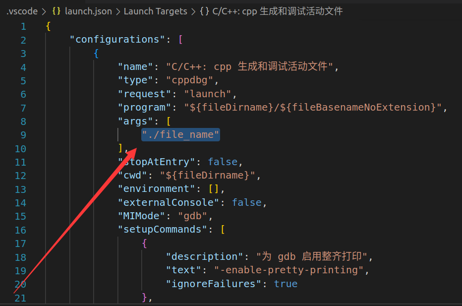

# 附录2 VsCode下编译与调试配置信息

-   tasks.json

    -   用来编译文件

    -   本实验由于pthread.h并非Linux标准库, 因此如果编译报错提示找不到pthread.h则需要额外的编译指令配置

        -   在tasks->args的选项中额外加上一个"-pthread"即可

            

-   launch.json

    -   用来执行与调试编译出来的文件

    -   本实验需要命令行参数 ( 通俗来讲main函数传参 ) , 因此需要额外的运行指令配置, 要注意按F5启动

        -   在configurations->args的选项中进行传入参数即可

            

-   推荐参考链接可以深入学习相关内容
    
    -   https://blog.csdn.net/qq_59084325/article/details/125662393