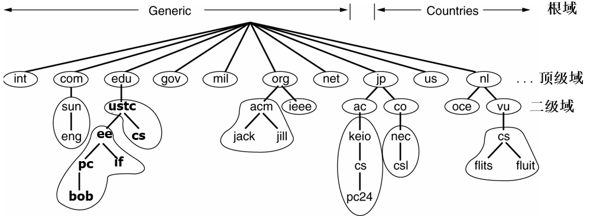
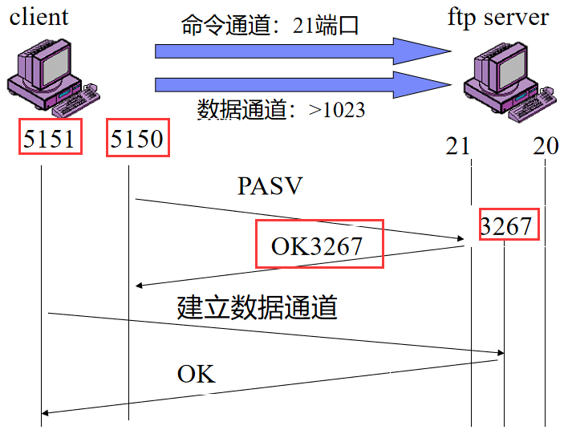
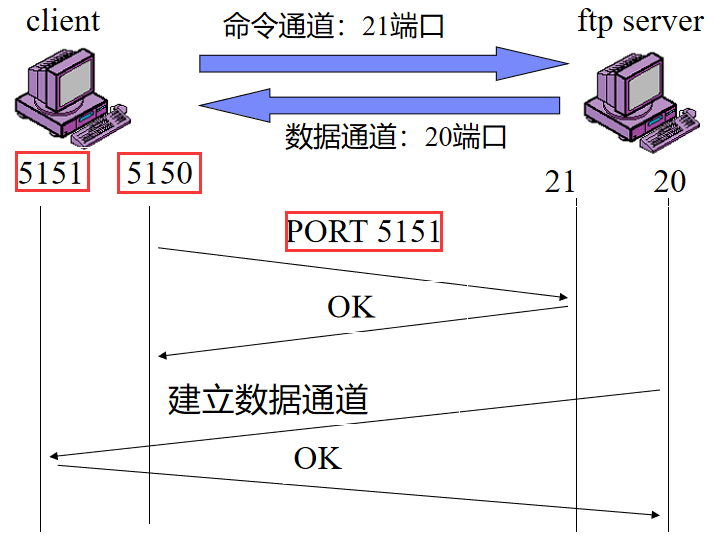
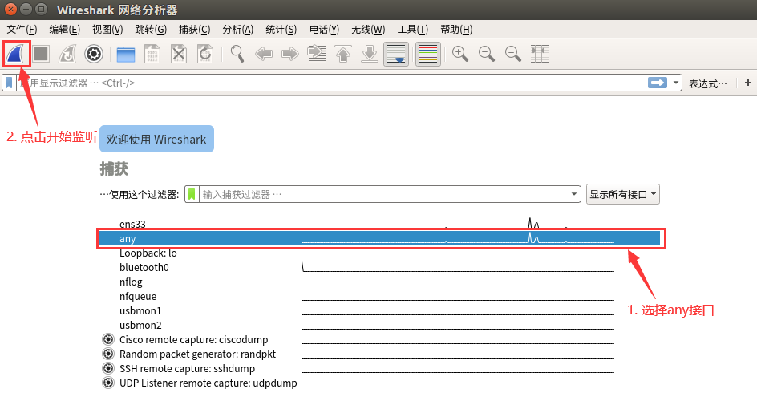

# 实验四 Wireshark抓包实例分析

[TOC]

上次实验, 我们在传输层完成了将不可靠传输协议可靠化, 更细致地理解了网络封包相关的概念. 本次实验我们来到应用层, 进行对一些具体应用层协议的学习. 应用层是TCP/IP模型的最顶层, 定义了主机程序如何与传输层服务交互以使用网络. 本次实验, 我们将学习如何使用常见的数据包分析工具, 并借此认识典型应用层协议 ( 比如HTTP, DNS, FTP等 ) 

## 1 实验原理

### 1.1 应用层协议

Internet以TCP/IP模型为基础进行构建, 依托操作系统的核心协议栈, 配合丰富的应用程序, 为用户提供功能强大, 稳定可靠的Internet网络服务. 从Internet协议栈的角度看, 自顶向下依次可以分为应用层, 传输层, 网络层, 网络接口层 ( 数据链路层与物理层 ) ; 从计算机系统的角度看, 应用层运行于用户空间中, 传输层, 网络层, 网络接口层运行于操作系统中. Internet网络通过对不同功能进行整合分层, 利用协议指定各层的交互规范, 配合各层之间的接口通信, 实现对外界的完整服务功能

用户为了使用某项特定的网络服务, 需要运行相应的网络应用程序, 执行相应的应用层协议, 在 TCP/IP 协议栈的密切配合下, 与对端进行通信, 从而执行相应的功能. 例如, 用户需要访问某个网站, 则需要打开浏览器, 输入该网站的网址字符串并回车. 客户端会利用DNS协议从DNS服务器获得该网站的域名所对应的IP地址, 之后根据获得的IP地址与被访问的服务器依次建立TCP连接与HTTP连接, 最后根据HTTP协议的回传数据在本地生成页面, 供用户查看

-   HTTP
    -   超文本传输协议 ( HyperText Transfer Protocol, HTTP ) 是互联网上应用最为广泛的一种网络传输协议. HTTP 协议通过统一资源定位器 ( URL ) 来标识服务器上的资源, 客户端可以向这个URL发送HTTP请求报文 ( Request Messages ) , 服务端根据情况返回响应报文
    -   请求报文中定义了方法 ( Methods ) , 来指示要在标识的资源上执行的所需操作. 常见的有<kbd>GET</kbd>, <kbd>POST</kbd>, <kbd>PUT</kbd>, <kbd>DELETE</kbd>, 近似可以认为分别对应获取, 创建, 修改, 删除
    -   响应报文中定义了状态码 ( Status code ) , 常见的404表示请求的资源不存在
        -   状态码的第一个数字定义了它的类
            -   <kbd>1XX</kbd>:  ( 信息性 ) 已收到请求, 继续处理

            -   <kbd>2XX</kbd> :  ( 成功的 ) 请求被成功接收, 理解和接受

            -   <kbd>3XX</kbd>:  ( 重定向 ) 需要采取进一步行动才能完成请求

            -   <kbd>4XX</kbd>:  ( 客户端错误 ) 请求包含错误的语法或无法完成

            -   <kbd>5XX</kbd>:  ( 服务器错误 ) 服务器未能满足明显有效的请求

    -   响应报文中也包含内容类型 ( Content Type ) , 该字段表示响应的数据是什么类型, 客户端可以根据这个字段解释数据包. 例如<kbd>text/html</kbd>表示是html文本, 而<kbd>image/png</kbd>表示png格式的图片
    -   一般来说, HTTP底层使用的是TCP传输协议, 但最新的HTTP/3要求使用UDP+QUIC传输协议代替TCP/IP连接, 从而克服TCP/IP连接拥塞的问题

-   HTTPS
    -   超文本传输安全协议 ( HyperText Transfer Protocol over Secure Socket Layer, HTTPS ) 是一种通过计算机进行安全通信的应用层传输协议. HTTPS利用标准的HTTP协议进行数据通信, 采用传输层安全协议SSL/TLS ( Socket Secure Layer/Transport Layer Security ) 来对数据包提供机密性与完整性服务, 同时对客户端与服务器的合法性进行认证
    -   与 HTTP 相比, HTTPS 的 URL 由<kbd>https://</kbd>起始, 默认传输层端口<kbd>443</kbd>, 而 HTTP 的 URL 由<kbd>http://</kbd>起始, 默认传输层端口<kbd>80</kbd>. 传统的HTTP协议没有过多考虑数据安全, 攻击者可以通过窃听以及中间人攻击等手段, 获取用户的敏感信息, 并发起攻击. HTTPS可以在不安全的网络环境中构造出一条安全的数据传输通道, 对应用层数据进行加密及认证, 抵御监听与中间人攻击等常见网络攻击, 保证浏览器与服务器之间的通信安全
    -   当使用 HTTPS 时, 请求文件的URL, 文件内容, 浏览器表单内容, cookie, HTTP头标内容均会被加密
    -   当需要建立HTTPS连接时, 客户端同时扮演HTTP的客户端和TLS的客户端, 首先是TLS握手过程, 然后是HTTP请求, 执行标准的 HTTP 过程. 当连接需要断开时, 会先关闭HTTPS, 再关闭SSL, TCP连接

-   DNS
    -   域名系统 ( Domain Name System, DNS) 是一项用于网络域名管理的互联网服务. 它作为将域名和IP地址相互映射的一个分布式数据库, 能够使人更方便地访问互联网. DNS使用TCP和UDP端口<kbd>53</kbd>. 当前, 对于每一级域名长度的限制是63个字符, 域名总长度则不能超过253个字符, 例如http://ustc.edu.cn, www.baidu.com等

    -   由于普通用户对于自然语言的记忆能力远强于二进制的IP地址, 而计算机网络必须依赖IP地址进行路由, 因此我们需要DNS服务来构建域名和IP地址的相互映射, 将普通用户输入的域名转化为计算机可以用于路由的IP地址

    -   DNS 采用层次化的名字空间, 每个层次都有多个名字, 每个名字对应着一个域, 这些名字也被称为域名. 域名由定义该层及以其上层名字的字符串组成, 不同层的字符串用<kbd>.</kbd>隔开, 例如科大官网下的信息网络实验室http://if.ustc.edu.cn从右至左可分为3层. 每个域都控制着如何分配直接在它下一层次的域, 也称为该域的子域. DNS名字空间被划分为一些不重叠的区域, 每个区域的信息保存在该区域对应的名字服务器上, 该服务器也被称为所在区域的授权名字服务器

        

    -   根名字服务保存了所有顶级域名字服务器的IP地址. 全球共有13个根名字服务器, 为确保可靠性和访问速度, 每个服务器实际上是由多个服务器组成的集群

    -   名字服务器以资源记录 ( Resource Record ) 的形式来维护本区域内的域名相关信息. 当解析器给名字服务器一个域名, 取回的是一个与该域名相对应的资源记录. 所以DNS系统的实际功能就是把域名映射到一条记录上

    -   一条资源记录共有 5 个字段: <kbd>Domain_name</kbd>, <kbd>Time_to_live</kbd>, <kbd>Type</kbd>, <kbd>Class</kbd>, <kbd>Value</kbd>
        -   <kbd>Domain_name</kbd>: 域名名称

        -   <kbd>Time_to_live</kbd>: 生存时间, 例如, 时间较长的有一天 ( 86400 秒 ) , 短的有一分钟 ( 60 秒 ) 
        -   <kbd>Type</kbd>: 指出记录的类型
        -   <kbd>Class</kbd>: 对 Internet, 它总是IN
        -   <kbd>Value</kbd>: 可以是数字, 域名或ASCII字符, 其语义基于记录类型

    -   常见的记录类型如下

        | 类型  | 全称           | 解释                                                         |
        | ----- | -------------- | ------------------------------------------------------------ |
        | A     | IPv4 Address   | IPv4 地址记录                                                |
        | AAAA  | IPv6 Address   | IPv6 地址记录                                                |
        | NS    | Name Server    | 域名服务器记录, 用来指定该域名由哪个 DNS 服务器来进行解析    |
        | MX    | Mail Exchange  | 邮件交换记录, 指向一个邮件服务器, 用于电子邮件系统发邮件时根据收信人的地址后缀来定位邮件服务器 |
        | CNAME | Canonical Name | 别名记录, 允许将多个名字映射到同一台计算机                   |
        | TXT   | Text           | 域名对应的文本信息, 一般指某个主机名或域名的说明             |

-   FTP
    -   文件传输协议 ( File Transfer Protocol, FTP ) 是一个用于在计算机网络上在客户端和服务器之间进行文件传输的应用层协议. 一般运行在<kbd>20</kbd>和<kbd>21</kbd>两个端口, 端口<kbd>20</kbd>用于在客户端和服务器之间传输数据流, 而端口<kbd>21</kbd>用于传输控制流

    -   FTP 有两种使用模式: 主动模式和被动模式

        -   主动模式要求服务端主动向客户端建立数据连接. 在这种情况下, 客户端的防火墙可能拦截服务端的连接建立请求. 因此增加了被动模式, 被动模式中服务端被动接收客户端的连接建立请求, 从而绕过客户端的防火墙

            |                     被动模式的通信流程                      |                     主动模式的通信流程                      |
            | :---------------------------------------------------------: | :---------------------------------------------------------: |
            |  |  |

### 1.2 网络分析工具

出于用户友好以及安全性的考虑, 市面上的网络应用都对Internet的运行过程进行了良好的封装, 普通人很难了解其中的细节. 网络专业人士会利用一些网络分析工具, 抓取Internet运行过程中的交互数据包, 并对数据包的内容进行分析, 从中提取出有效信息加以利用. 

本次实验, 我们需要利用常见的网络应用程序, 请求特定的网络服务, 利用Wireshark等网络分析工具获取通信过程中的交互数据包, 并对报文内容进行分析, 将计算机网络理论与日常网络实践相结合, 在实际场景中理解Internet的分层, 接口, 协议的原理与实现, 提升对于计算机网络的认识

-   Wireshark

    -   在Linux环境下, 启动Wireshark应按照如下步骤进行: 在Linux终端里使用命令<kbd>sudo wireshark</kbd>打开Wireshark
    -   在Windows里, 管理员运行Wireshark即可
    -   不用超级管理员权限, Wireshark可能看不到网络接口
    -   选择<kbd>any</kbd>接口进行监听, 监听所有网络接口
-   另外, 同学们也可以学习一下另一款抓包软件TCPdump来进行分析数据包. 这款软件是命令行的界面, 有点较难使用
    
    

## 2 实验内容

1.  实验要求
    -   本实验在Windows或Linux操作系统下均可进行, 但需要安装Wireshark抓包工具
    -   Windows下的安装可直接运行[安装包 Wireshark](安装包 wireshark.exe)
    -   Linux下的安装请参考教学视频
    -   cURL是一个命令行工具, 用于使用URL语法来模拟网络请求, 支持HTTP/HTTPS等多种网络协议. 本次实验中, 我们主要使用cURL产生数据包

2.  TCP
    -   启动Wireshark, 开始监听数据包. 在终端中执行<kbd>curl -4 http://www.example.com</kbd>指令, 并从Wireshark 中找到TCP连接建立时三次握手以及连接释放时的数据包, 截图并填写到[检查文档](检查.md)文件TCP表里. <kbd>Seq</kbd>号和<kbd>Ack</kbd>号填相对的, <kbd>Flags</kbd>填括号里的部分

3.  HTTP/HTTPS
    -   在终端中执行<kbd>curl -v http://www.example.com</kbd>指令, 该指令会显示详细的请求报文和响应报文. 可以用Web浏览器访问网网址http://www.example.com, 结合显示的网页理解报文的内容. 注意观察HTTP协议版本,  HTTP方法类型, 状态码, 内容类型
    -   启动Wireshark, 开始监听数据包. 在终端中分别执行[检查文档](检查.md)附表中其余的指令, 并从Wireshark 中找到对应的HTTP/HTTPS数据包, 分别截图并填写到[检查文档](检查.md)文件HTTP/HTTPS表里

4.  DNS
    -   启动Wireshark, 开始监听数据包. 在终端中执行<kbd>curl http://www.example.com</kbd>指令, 并从Wireshark中找到对应的DNS数据包, 分别截图并填写到[检查文档](检查.md)文件DNS表1里
    -   指定<kbd>8.8.8.8</kbd>为DNS服务器, 根据表2的要求, 使用<kbd>dig</kbd>查询对应的DNS记录, 并填写到[检查文档](检查.md)文件DNS表2里
    -   <kbd>dig</kbd>不带域名可以用来查询根域名服务器, 截图查询结果
    -   使用<kbd>dig</kbd>, 发起对<kbd><your-student-id>.ustc.edu.cn</kbd>的查询请求, 试想能获得有效的DNS查询结果吗, 记录回复的status字段, 截图说明
        -   注意, <kbd><your-student-id></kbd>处填写你的学号

5.  FTP

    -   此实验建议在Linux虚拟机上进行

    -   使用Wireshark观察FTP的两种数据传输模式 ( 主动模式和被动模式 ) 的区别
    -   打开Wireshark, 开始抓取本机和<kbd>http://home.ustc.edu.cn</kbd>之间通信的数据包
    -   进入终端, 输入命令<kbd>ftp -4 home.ustc.edu.cn</kbd>, 进入ftp的交互界面. 提示需要登录, 用户名是你的科大邮箱名 ( @mail之前的那几个字母 ) , 密码是你的科大邮箱密码. 登录后, 默认是主动模式. 输入命令<kbd>passive</kbd>, 可以进入被动模式. 再输入一次<kbd>passive</kbd>, 会退出被动模式回到主动模式. <kbd>quit</kbd>命令可以退出FTP
    -   在终端里的ftp交互界面输入<kbd>ls</kbd>命令, 显示ftp服务端的当前目录. 分别在分别在主动模式和被动模式两种状态下执行该操作, 并在终端1中观察两种模式的通信过程
    -   对于主动模式, 寻找客户端发送<kbd>PORT</kbd>命令. 根据<kbd>PORT</kbd>后面的参数, 计算客户端开启的数据端口的端口号. 截图说明
    -   对于被动模式, 寻找客户端发送的<kbd>PASV</kbd>命令和服务端的回复<kbd>Entering Passive Mode</kbd>. 根据<kbd>Entering Passive Mode</kbd>后面的参数, 计算服务端开启的数据端口的端口号, 并将计算的结果和后续数据包比对. 截图说明
    -   可能遇到的问题
        -   Q: 被动模式记录了大量的<kbd>PASV</kbd>命令, 没有服务端的回复<kbd>Entering Passive Mode</kbd>
            A: 重做几次, 一般第二次就会恢复正常
        -   Q: 主动模式下输入<kbd>ls</kbd>会返回<kbd>illegal PORT command</kbd>
            A: 对实验无影响, 仍然可以找到`PORT`命令的数据包

## 3 实验报告

1.  实验报告要求完成以下思考题
    -   解释HTTP中的幂等是什么意思 ( 可以联想一下线性代数里的矩阵的意义以及幂等矩阵 ) 
    -   GET操作是幂等的吗, POST呢 
    -   HTTPS抓到的数据包与之前HTTP中抓到的有何不同, 这是什么原因导致的
    -   解释从输入网址, 到浏览器显示网页, 在应用层依次发生了什么

## 附录1 实验指导视频

-   本次实验指导视频链接
    -   https://www.bilibili.com/video/